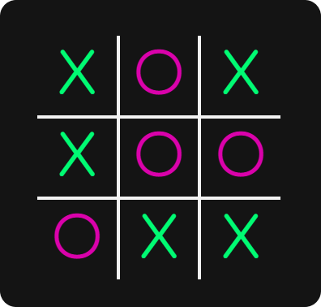

# Tic Tac Toe Game

Welcome to the classic Tic Tac Toe game! This simple yet addictive game allows you to challenge your friends. Whether you're a beginner or a Tic Tac Toe pro, this game is perfect for passing the time and honing your strategic skills.



## Features

- **Play against a friend:** Challenge your friend to a classic Tic Tac Toe match and see who emerges victorious.
- **Responsive design:** Enjoy seamless gameplay experience across all devices, from desktops to mobile phones.
- **Beautiful interface:** Stunning visuals and intuitive user interface enhance the gaming experience.
- **Theme Friendly:** Exprerience in Dark and Light Modes according to your Device's preferences.

## Demo

Check out the live demo [here](http://muhammadtalha15.github.io/Tic-Tac-Toe/).

## How to Play

1. **Start the game:** Click on the grid cells to place your marks (X or O).
2. **Win the game:** Achieve three marks in a row, column, or diagonal to win the game.
3. **Play again:** After the game ends, choose to play another round with the same opponent or switch to a different mode.

## Technologies Used

- **HTML/CSS:** Used for structuring and styling the game interface.
- **JavaScript:** Implemented game logic and interactivity.

## Installation

1. Clone the repository:

   ```bash
   git clone https://github.com/muhammadtalha15/Tic-Tac-Toe.git
